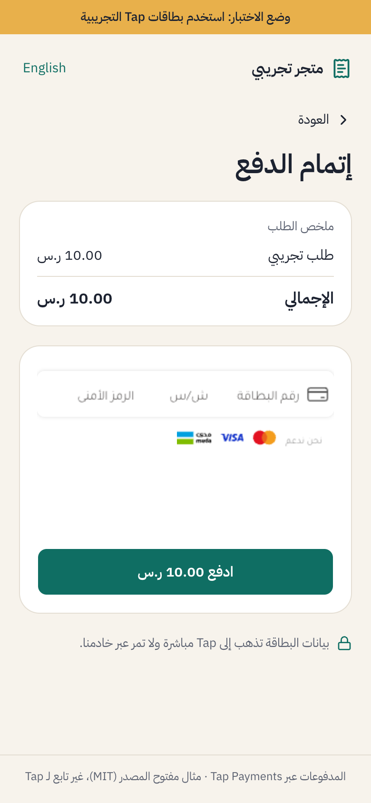
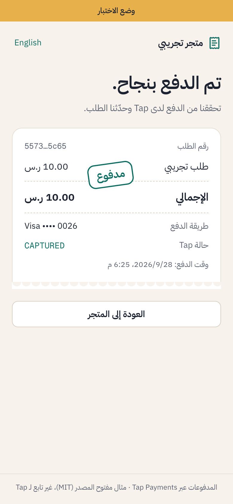

# nextjs-rtl-starter

An open-source Next.js App Router starter for **Arabic RTL apps that take payment in the Gulf**. It has an Arabic and English UI built on shadcn/ui in RTL mode, and a working **Tap Payments** checkout: mada, Visa, Mastercard, Apple Pay, STC Pay and KNET. Payments are verified on the server, and every webhook's signature is checked.

قالب Next.js مفتوح المصدر للتطبيقات العربية من اليمين إلى اليسار: واجهة بالعربية والإنجليزية، ودفع عبر Tap بمدى وVisa وMastercard وApple Pay وSTC Pay وKNET، مع التحقق من الدفع على الخادم ومن توقيع الـ webhooks.

It takes about 10 minutes from clone to a first test payment, on Tap's public test keys. You don't need a Tap account to try it.

| Arabic checkout | Paid receipt |
|---|---|
|  |  |

Unofficial; not affiliated with Tap Payments.

## Why this exists

Most Next.js starters bill through Stripe. Stripe doesn't serve businesses registered in Saudi Arabia, Qatar, Kuwait, Bahrain or Oman ([Stripe's country list](https://stripe.com/global)). Tap works across the Gulf and has the card field and the API, but the Next.js glue is missing. That glue is:

- where the card field goes
- how to turn its token into a charge
- how to confirm the charge before you trust it
- how to check a webhook's signature, which only matches if the amount is formatted exactly the way Tap formats it

This repo is that glue.

## What's in it

- `app/[lang]/page.tsx`: a store page with one sample order. **Pay now** creates the order on the server (`app/[lang]/actions.ts`), so the amount never comes from the browser.
- `app/[lang]/checkout/[orderId]/page.tsx`: Tap's card field (Card SDK v2) in Arabic RTL or English, with Apple Pay, STC Pay and KNET above it when they're turned on. The card is tokenized in the browser; only the token reaches your server.
- `app/api/charges/route.ts`: creates the charge from the token (or the STC Pay or KNET source) and returns the page Tap sends the customer to, usually 3-D Secure.
- `app/api/charges/[id]/otp/route.ts`: sends the STC Pay SMS code back on the charge.
- `app/[lang]/checkout/result/page.tsx`: the page Tap redirects back to. It fetches the charge with your secret key and checks the status, amount, currency and order before marking anything paid.
- `app/api/webhooks/tap/route.ts`: checks Tap's `hashstring` signature, answers right away, then handles `CAPTURED` and the failed statuses.
- `lib/tap.ts`: a small typed client (create charge, retrieve charge, send the STC Pay code), with a 15-second timeout and Tap's error codes.
- `lib/payments.ts` and `lib/verify.ts`: the one place an order becomes paid, used by both the result page and the webhook.
- `lib/webhook.ts`: the `hashstring` check.
- `lib/money.ts`: amounts in minor units, with each currency's decimals taken from `Intl` (2 for SAR, AED and QAR, 3 for KWD, BHD and OMR). Arabic prices use Western digits.
- `lib/orders.ts`: an in-memory order store, so the demo runs with no database. Replace it with your own table.
- `proxy.ts`: sends `/` to `/ar` or `/en` by the browser's language, Arabic when unsure.
- shadcn/ui with `rtl: true`, IBM Plex Sans Arabic, and `dir="rtl"` set per locale, so layout, spacing and icons flip for Arabic.

## Quick start

You need Node 22 or later.

1. **Clone and install.**

   ```bash
   git clone https://github.com/ahzab/nextjs-rtl-starter
   cd nextjs-rtl-starter
   npm install
   cp .env.example .env.local
   ```

2. **Keys.** `.env.example` ships with Tap's public test keys, the ones Tap publishes for everyone to [start an integration](https://developers.tap.company/reference/testing-keys). They're fine for a first run, but they're shared: every developer using them sees the same test merchant. For your own dashboard, sign up at [tap.company](https://www.tap.company) and put your own keys in `.env.local`:

   ```bash
   TAP_SECRET_KEY=sk_test_...
   NEXT_PUBLIC_TAP_PUBLIC_KEY=pk_test_...
   TAP_MERCHANT_ID=...
   ```

   Every variable is listed with a comment in `.env.example`.

3. **Run it.** Start `npm run dev`, open `http://localhost:3000/ar` (or `/en`), press **Pay now**, and pay with one of Tap's [test cards](https://developers.tap.company/reference/testing-cards), expiry `01/39`, any CVV and any cardholder name:

   | Card | Number |
   |---|---|
   | mada | `4464 0400 0000 0007` |
   | Mastercard | `5123 4500 0000 0008` |
   | Visa | `4012 0000 3333 0026` |

   Every charge goes through 3-D Secure. In test mode Tap shows its "ACS Emulator": leave the result on **(Y) Authentication** and press **Submit**. You land back on the result page, which shows the order as paid once Tap confirms the charge.

4. **Webhooks (optional locally).** Tap can't post to `localhost`. Expose port 3000 over HTTPS, for example with `npx cloudflared tunnel --url http://localhost:3000`, and set `APP_URL` in `.env.local` to the tunnel URL. Each charge tells Tap where to post (`post.url`), so there's nothing to register in a dashboard.

`npm run check` runs lint, typecheck and the tests.

## How a payment flows

1. **Pay now** creates an order on the server and opens its checkout page.
2. The checkout page renders Tap's card field with your public key and the order's amount and currency.
3. On **Pay**, the browser tokenizes the card (`tok_…`). The card number never reaches your server.
4. Your server creates a charge from the token, taking the amount from the order, with a `redirect.url` and a `post.url`. It sends the customer to Tap's 3-D Secure page.
5. Tap redirects back to `/<lang>/checkout/result?tap_id=chg_…`.
6. The result page fetches the charge from Tap with your secret key. It marks the order paid only if the charge is the one recorded on the order, its status is `CAPTURED`, and the amount and currency match. **Never trust the redirect alone:** anyone can type a URL with an id in it.
7. The webhook arrives separately and confirms the same charge. It's the source of truth when the customer's browser closed before step 6. Either can arrive first; marking an order paid twice changes nothing.

## The two checks that matter

**Verify on the server.** Both the result page and the webhook go through `confirmCharge` in `lib/payments.ts`: fetch the charge with the secret key, find the order it names, and check it against that order (`lib/verify.ts`):

```ts
export function checkCharge(charge: ChargeLike, order: OrderLike | null): Rejection | null {
  if (!order) return "no_order";
  if (order.chargeId !== charge.id) return "charge_mismatch";
  if (charge.status !== "CAPTURED") return "not_captured";
  if (charge.currency !== order.currency) return "currency_mismatch";
  if (fromTapAmount(charge.amount, charge.currency) !== order.amount) return "amount_mismatch";
  return null;
}
```

**Check the webhook's `hashstring`.** Tap signs each post with an HMAC-SHA256 of seven fields, keyed with your secret key, and sends it in the `hashstring` header. The step people get wrong is the amount: it has to be written with the currency's own decimals (`1.00` for SAR, `1.000` for KWD) before hashing. Hash the number as the JSON gives it (`1`) and every real post fails. From `lib/webhook.ts`:

```ts
export function hashInput(body: Posted): string {
  const currency = text(body.currency);
  return (
    `x_id${text(body.id)}` +
    `x_amount${currency ? hashAmount(body.amount, currency) : ""}` +
    `x_currency${currency}` +
    `x_gateway_reference${text(body.reference?.gateway)}` +
    `x_payment_reference${text(body.reference?.payment)}` +
    `x_status${text(body.status)}` +
    `x_created${text(body.transaction?.created)}`
  );
}
```

The route compares the hashes in constant time, answers 200 straight away and does the work in `after()`, because Tap retries twice and then marks the post `ERROR` if your endpoint doesn't answer. The hash doesn't cover `reference.order`, so the route takes only the charge id from the body and reads the rest back from Tap. Tap only posts `CAPTURED` and failed charges; `INITIATED` and `ABANDONED` charges aren't posted.

## Payment methods

Cards (mada, Visa, Mastercard) work with Tap's test keys and no other setup. Apple Pay, STC Pay and KNET each need something done outside this code, so each is off until you turn on its flag in `.env.local`. When a method is on but can't be used, the checkout says why and still shows the card field. In test mode it also tells you, the developer, what to fix.

| Method | Flag | Currency | Needs |
|---|---|---|---|
| Apple Pay | `NEXT_PUBLIC_TAP_APPLE_PAY=1` | any the card field takes | `TAP_MERCHANT_ID`, your domain registered with Tap, Safari on an Apple device |
| STC Pay | `NEXT_PUBLIC_TAP_STC_PAY=1` | SAR only | Tap turning it on for your account |
| KNET | `NEXT_PUBLIC_TAP_KNET=1` | KWD only | Tap turning it on for your account |

The flags start with `NEXT_PUBLIC_` because the checkout page reads them too. Restart `npm run dev` after changing one.

### Apple Pay

Tap handles the Apple merchant certificate. You prove you own the domain:

1. Ask Tap support for the Apple Pay domain-verification file.
2. Save it as `public/.well-known/apple-developer-merchantid-domain-association` (no extension) and deploy. Check it opens at `https://<your-domain>/.well-known/apple-developer-merchantid-domain-association`.
3. Send Tap the domain (and each subdomain you use) and ask them to register it with Apple Pay. The file has to be live before they do.
4. Set `TAP_MERCHANT_ID` (your merchant id from Tap's dashboard) and `NEXT_PUBLIC_TAP_APPLE_PAY=1`.

Apple Pay can't run on `localhost`: it needs HTTPS on a registered domain. The button only shows in Safari on an Apple device with a card in Wallet; everywhere else the checkout says Apple Pay isn't available and offers the card. The button comes from Tap's `@tap-payments/apple-pay-button` and returns a Tap token, which `/api/charges` charges like a card.

### STC Pay

STC Pay is off on Tap accounts until Tap turns it on. Ask your Tap account manager. Until then Tap answers error 1243, and the checkout shows "STC Pay isn't turned on for this Tap account" next to the card field. Tap's shared test keys don't have it.

The customer enters their STC Pay number, gets a code by SMS and types it in. The server creates the charge with source `src_sa.stcpay`, then sends the code back on it (`/api/charges/<id>/otp`). The result page then checks the charge with Tap like any other. Sandbox numbers from Tap's docs: 0548220713 or 0550955806, code 123456.

### KNET

KNET takes Kuwaiti dinars only, so it shows only on a KWD order. To try it, set `SAMPLE_CURRENCY=KWD` so the sample order is priced in dinars. The customer is sent to KNET's page to enter the card and PIN, then back to the result page. Tap's KNET test card: 8888880000000001, expiry 09/30, PIN 1234.

KNET also needs Tap to turn it on for your account. Tap's shared test keys create KNET charges but decline them straight away (code 515), so test it with your own Tap test account.

## Going live

- Switch to your own `pk_live_…` and `sk_live_…` keys once Tap activates your account. A live secret key also turns off the test-mode banner and the developer notes.
- Keep `TAP_SECRET_KEY` server-only. Never prefix it with `NEXT_PUBLIC_`.
- Set `APP_URL` to your production URL.
- Replace `lib/orders.ts` (an in-memory demo store) with your database. In memory, orders vanish on restart and aren't shared between serverless instances.
- Replace the sample customer in `app/api/charges/route.ts` with your signed-in customer. Tap needs a first name plus an email or phone on every charge.

## Need subscriptions?

This repo covers one-time payments. Monthly billing on Tap means:

- saving the card on the first charge
- storing the customer, card and payment agreement ids
- creating a fresh token for every renewal, since saved-card tokens expire after 5 minutes
- charging it as a merchant-initiated payment on schedule
- retrying failures and handling cancellations

**Next.js RTL SaaS Starter** (paid) adds that part, on a full SaaS base:

- Monthly and yearly plans on saved cards (mada, Visa, Mastercard), with renewals, retries and cancel
- Auth, dashboard, billing page and plan limits
- Full Arabic and English UI, with SAR, KWD and AED formatting
- Deploy guide and updates

**[Join the early-access list](<GUMROAD_URL>)**

## License

[MIT](LICENSE). Unofficial; not affiliated with Tap Payments.
